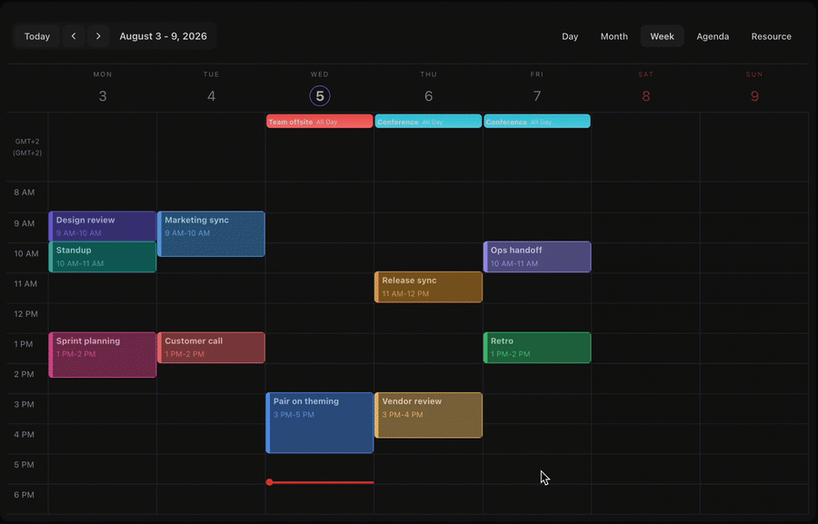

<br />

<p align="center">
  
</p>

<p align="center">
  <a href="https://www.npmjs.com/package/@mhcalendar/calendar"></a>
  <a href="https://opensource.org/licenses/MIT"></a>
  <a href="https://github.com/mhcalendar/mhcalendar/actions/workflows/ci.yml"></a>
  <a href="https://bundlephobia.com/package/@mhcalendar/calendar"></a>
</p>

A highly customizable, full-sized event calendar built with TypeScript, Stencil, and Day.js.

<p align="center">
  
</p>

> [!WARNING]
> mhcalendar is currently in its `0.x.x` phase. As per Semantic Versioning, the API is not yet stable, and any new minor or patch release might introduce breaking changes. We recommend pinning the exact version in your `package.json` until we reach `1.0.0`.

## Why mhcalendar?

mhcalendar is built around easy **customization as a first-class feature**. You get full, unrestricted access to the calendar's styling. You can style it exactly how you want by using CSS variables, overriding inline styles, or utilizing our custom properties.

### Key Features

- **Customization**: style it your way.
- **Framework Agnostic**: built as a Web Component with Stencil.
- **Lightweight by Design**: keeps the dependency footprint tiny.
- **Advanced Timezones**: supports multiple IANA timezones simultaneously.
- **Localization**: configurable day/month names (`locale`) and UI text (`labels`).
- **Fully Interactive**: drag & drop event management and event resizing.
- **Multiple Views**: Month, Week, Day, Agenda, and Resource.
- **Business Hours**: define business hours, block out-of-office dragging, and visualize non-business time.

## Documentation

📖 Full documentation, guides, and API reference are available at **[mhcalendar.dev](https://mhcalendar.dev)**.
The docs are under active development, so some pages may be incomplete or lag behind the latest
release. If you notice something missing or inaccurate, please
[open an issue](https://github.com/mhcalendar/mhcalendar/issues) or submit a pull request.

## Installation

If you are using React, you might want to check out our official React component:
👉 [**@mhcalendar/react**](https://www.npmjs.com/package/@mhcalendar/react)

If you are building a Vanilla JS project, install the core package via your preferred package manager:

```bash
# npm
npm install @mhcalendar/calendar

# yarn
yarn add @mhcalendar/calendar

# pnpm
pnpm add @mhcalendar/calendar
```

---

## Quick Start

Import and initialize the web component in your app's entry file (e.g., `main.ts`):

```javascript
import { defineCustomElements } from '@mhcalendar/calendar/loader';

// Registers the <mh-calendar> custom element in the browser
defineCustomElements();
```

Example usage:

```html
<html>
  <head>
    <title>Vanilla - 1</title>
    <meta charset="utf-8" />
    <meta name="viewport" content="width=device-width, initial-scale=1.0" />
  </head>
  <body>
    <script type="module" src="/src/main.js"></script>
    <mh-calendar id="my-calendar"></mh-calendar>
    <script type="module">
      const mhcalendar = document.getElementById('my-calendar');

      const now = new Date();
      const startDate = new Date(now.getFullYear(), now.getMonth(), now.getDate(), 10, 0);
      const endDate = new Date(now.getFullYear(), now.getMonth(), now.getDate(), 11, 30);

      mhcalendar.config = {
        viewType: 'WEEK',
        showTimeFrom: 9,
        showTimeTo: 18,
        allowEventDragging: true,
      };
      mhcalendar.events = [
        {
          id: '1',
          title: 'Team Meeting',
          startDate,
          endDate,
        },
      ];
    </script>
  </body>
</html>
```

## Contributing

Contributions are welcome! If you'd like to report a bug, suggest a feature, or submit a pull request, please open an issue first to discuss what you'd like to change.

## Changelog

See [CHANGELOG.md](https://github.com/mhcalendar/mhcalendar/blob/main/packages/calendar/CHANGELOG.md) for a full list of changes between releases.

## License

mhcalendar is [MIT Licensed](https://opensource.org/licenses/MIT).
